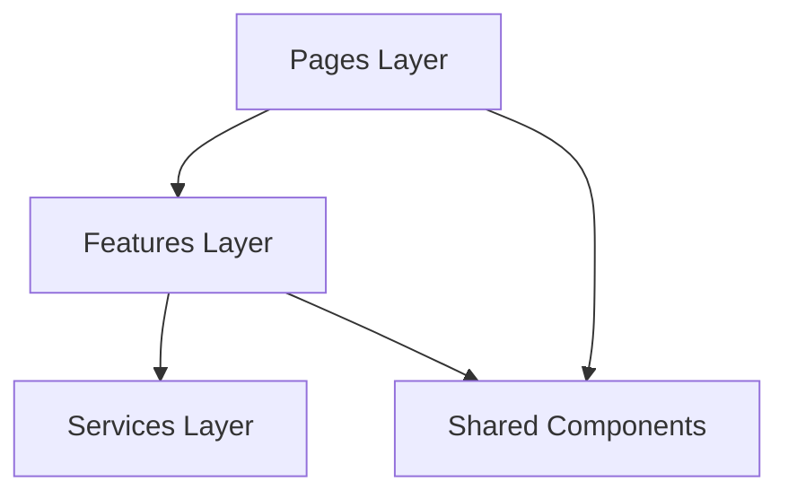

## Overview

The Auth Dashboard follows a feature-based architecture with clear separation of concerns. The application is built with React, TypeScript, and modern tooling to ensure maintainability and scalability.

## Project Structure

The codebase is organized into logical domains, making it easy to locate and modify functionality:

```
src/
├── app/                    # Application-level routing and guards
│   ├── router.tsx         # Main router configuration
│   ├── ProtectedRoute.tsx # Authentication guard for private routes
│   └── PublicRoute.tsx    # Guard for public-only routes (e.g., login)
│
├── features/              # Feature modules (domain-driven)
│   ├── auth/             # Authentication feature
│   │   ├── authStore.tsx     # Zustand store for auth state
│   │   ├── authService.ts    # API calls for authentication
│   │   ├── useAuth.ts        # Custom hook
│   │   └── types.ts          # TypeScript interfaces
│   │
│   └── users/            # User management feature
│       ├── usersStore.ts     # Zustand store for users state
│       ├── usersService.ts   # API calls for users
│       ├── types.ts          # TypeScript interfaces
│       └── components/       # Feature-specific components
│
├── pages/                 # Page components (route views)
│   ├── Login.tsx
│   └── dashboard/
│       ├── Dashboard.tsx
│       ├── Users.tsx
│       ├── UserDetails.tsx
│       └── Settings.tsx
│
├── shared/                # Shared resources across features
│   ├── components/       # Reusable UI components
│   ├── layout/           # Layout components
│   └── store/            # Global stores (toast, settings)
│
├── services/             # Core services
│   └── api.ts           # Axios instance with interceptors
│
└── i18n/                 # Internationalization
    └── index.ts
```

## Architecture Principles

### Feature-Based Organization

Each feature is self-contained with its own store, services, types, and components:

<CodeGroup>
```typescript features/auth/authStore.tsx
import { create } from "zustand";
import { persist } from "zustand/middleware";
import { loginRequest } from "./authService";
import type { AuthState } from "./types";

export const useAuthStore = create<AuthState>()(\n  persist(
    (set) => ({
      user: null,
      loading: false,

      login: async (username, password) => {
        try {
          set({ loading: true });
          const data = await loginRequest({ username, password });
          set({ user: data, loading: false });
          localStorage.setItem("token", data.token);
        } catch (error) {
          set({ loading: false });
          console.error(error);
          alert("Credenciales incorrectas");
        }
      },

      logout: () => {
        localStorage.removeItem("token");
        set({ user: null });
      },
    }),
    { name: "auth-storage" }
  )
);
```

```typescript features/auth/authService.ts
import { api } from "../../services/api";
import type { AuthUser } from "./types";

interface LoginCredentials {
  username: string;
  password: string;
}

export const loginRequest = async ({
  username,
  password
}: LoginCredentials): Promise<AuthUser> => {
  const { data } = await api.post("/auth/login", {
    username,
    password,
    expiresInMins: 30,
  });

  return {
    id: data.id,
    firstName: data.firstName,
    lastName: data.lastName,
    email: data.email,
    image: data.image,
    token: data.accessToken,
  };
};
```
</CodeGroup>

### Separation of Concerns

<CardGroup cols={2}>
  <Card title="Store" icon="database">
    State management and business logic using Zustand
  </Card>
  <Card title="Service" icon="cloud">
    API calls and data transformation logic
  </Card>
  <Card title="Types" icon="code">
    TypeScript interfaces and type definitions
  </Card>
  <Card title="Components" icon="window">
    UI components specific to the feature
  </Card>
</CardGroup>

## Layered Architecture

The application follows a clear layered architecture:



### Layer Responsibilities

**Pages Layer** (`src/pages/`)
- Route-level components
- Page composition and layout
- Minimal business logic
- Connects features together

**Features Layer** (`src/features/`)
- Domain-specific logic
- State management per feature
- API integration for the feature
- Feature-specific components

**Services Layer** (`src/services/`)
- HTTP client configuration
- Global interceptors
- Shared utilities

**Shared Layer** (`src/shared/`)
- Reusable UI components
- Layout components
- Global state (toast, settings)

## State Management Strategy

<Info>
The application uses Zustand for state management with the persist middleware for data persistence.
</Info>

Each feature has its own store:

- **Auth Store** (`features/auth/authStore.tsx`): User authentication state
- **Users Store** (`features/users/usersStore.ts`): User management state
- **Toast Store** (`shared/store/useToastStore.ts`): Global notifications
- **Settings Store** (`shared/store/useSettingsStore.ts`): App preferences

Example store structure from `features/users/usersStore.ts:18-66`:

```typescript
export const useUsersStore = create<UsersState>()(\n  persist(
    (set, get) => ({
      users: [],
      loading: false,
      error: null,
      deletingId: null,

      fetchUsers: async () => {
        if (get().users.length > 0) return;
        try {
          set({ loading: true, error: null });
          const usersFromApi = await getUsers();
          set({ users: usersFromApi, loading: false });
        } catch {
          set({ error: "Error fetching users", loading: false });
        }
      },

      addUser: (user) =>
        set((state) => ({
          users: [user, ...state.users],
        })),

      deleteUser: (id) => {
        set({ deletingId: id });
        set((state) => ({
          users: state.users.filter((user) => user.id !== id),
          deletingId: null,
        }));
      },

      updateUser: (updatedUser: User) =>
        set((state) => ({
          users: state.users.map((user) =>
            user.id === updatedUser.id ? updatedUser : user
          ),
        })),
    }),
    { name: "users-storage" }
  )
);
```

## Routing Architecture

The router configuration uses nested routes with layout components. See [Routing](/development/routing) for detailed information.

## API Integration

Centralized API configuration with axios interceptors for authentication. See [API Integration](/development/api-integration) for details.

## Component Library

Shared components are built with composition in mind. See [Components](/development/components) for the component library.

## Best Practices

<AccordionGroup>
  <Accordion title="Feature Module Guidelines">
    - Keep features isolated and self-contained
    - Each feature should have its own types, store, service, and components
    - Don't import from other features directly
    - Use shared components for common UI patterns
  </Accordion>

  <Accordion title="State Management Guidelines">
    - One store per feature domain
    - Use persist middleware for data that should survive page refreshes
    - Keep stores focused on a single responsibility
    - Implement optimistic updates where appropriate
  </Accordion>

  <Accordion title="TypeScript Guidelines">
    - Define types in separate `types.ts` files
    - Use interfaces for object shapes
    - Leverage type inference where possible
    - Export types for reuse across the feature
  </Accordion>

  <Accordion title="Component Guidelines">
    - Feature-specific components go in `features/{name}/components/`
    - Reusable components go in `shared/components/`
    - Use composition over prop drilling
    - Keep components focused on a single responsibility
  </Accordion>
</AccordionGroup>

## Adding a New Feature

To add a new feature to the application:

<Steps>
  <Step title="Create feature folder">
    Create a new folder under `src/features/` with the feature name:
    ```bash
    mkdir -p src/features/my-feature/components
    ```
  </Step>

  <Step title="Define types">
    Create `types.ts` with TypeScript interfaces:
    ```typescript
    export interface MyFeatureData {
      id: number;
      name: string;
    }

    export interface MyFeatureState {
      data: MyFeatureData[];
      loading: boolean;
      fetchData: () => Promise<void>;
    }
    ```
  </Step>

  <Step title="Create service">
    Create `myFeatureService.ts` for API calls:
    ```typescript
    import { api } from "../../services/api";
    import type { MyFeatureData } from "./types";

    export const getMyFeatureData = async (): Promise<MyFeatureData[]> => {
      const { data } = await api.get("/my-feature");
      return data;
    };
    ```
  </Step>

  <Step title="Create store">
    Create `myFeatureStore.ts` with Zustand:
    ```typescript
    import { create } from "zustand";
    import { getMyFeatureData } from "./myFeatureService";
    import type { MyFeatureState } from "./types";

    export const useMyFeatureStore = create<MyFeatureState>((set) => ({
      data: [],
      loading: false,
      fetchData: async () => {
        set({ loading: true });
        const data = await getMyFeatureData();
        set({ data, loading: false });
      },
    }));
    ```
  </Step>

  <Step title="Add routes">
    Add routes in `src/app/router.tsx` and create page components in `src/pages/`
  </Step>
</Steps>

## Next Steps

<CardGroup cols={2}>
  <Card title="State Management" icon="database" href="/development/state-management">
    Learn about Zustand stores and state patterns
  </Card>
  <Card title="Routing" icon="route" href="/development/routing">
    Understand the routing structure and guards
  </Card>
  <Card title="API Integration" icon="plug" href="/development/api-integration">
    Configure API calls and interceptors
  </Card>
  <Card title="Components" icon="layer-group" href="/development/components">
    Explore the shared component library
  </Card>
</CardGroup>
