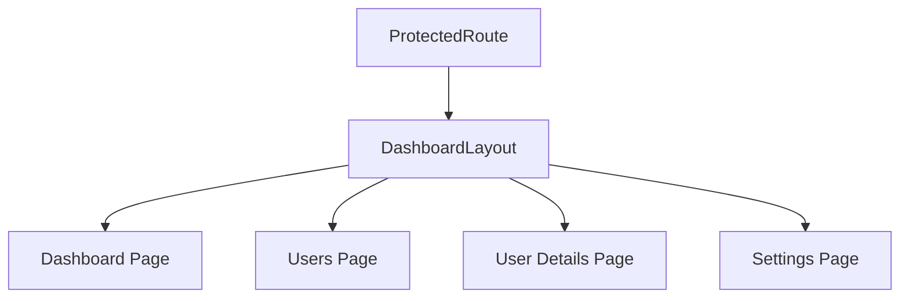
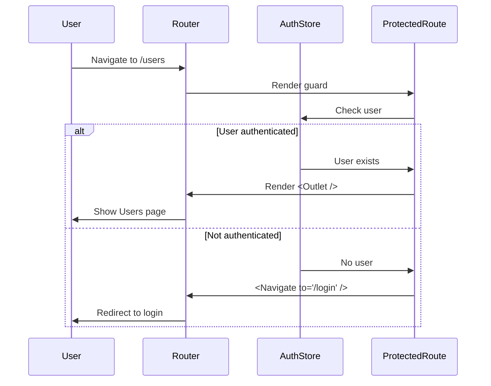

## Overview

The Auth Dashboard uses [React Router v6](https://reactrouter.com/) for client-side routing with a nested route structure and authentication guards.

<Info>
The routing system provides automatic route protection, layout composition, and type-safe navigation.
</Info>

## Router Configuration

The main router is configured in `src/app/router.tsx:12-32`:

```tsx
import { createBrowserRouter } from "react-router-dom";
import Login from "../pages/Login";
import ProtectedRoute from "./ProtectedRoute";
import { DashboardLayout } from "../shared/layout/DashboardLayout";
import Dashboard from "../pages/dashboard/Dashboard";
import PublicRoute from "./PublicRoute";
import Users from "../pages/dashboard/Users";
import UserDetails from "../pages/dashboard/UserDetails";
import Settings from "../pages/dashboard/Settings";

export const router = createBrowserRouter([
  {
    element: <PublicRoute />,
    children: [{ path: "/login", element: <Login /> }],
  },
  {
    element: <ProtectedRoute />,
    children: [
      {
        path: "/",
        element: <DashboardLayout />,
        children: [
          { index: true, element: <Dashboard /> },
          { path: "users", element: <Users /> },
          { path: "users/:id", element: <UserDetails /> },
          { path: "settings", element: <Settings /> },
        ],
      },
    ],
  },
]);
```

## Route Structure

The application has a clear route hierarchy:

```
/
├── /login (public only)
└── / (protected)
    ├── / (dashboard home)
    ├── /users (user list)
    ├── /users/:id (user details)
    └── /settings (app settings)
```

### Route Types

<Tabs>
  <Tab title="Public Routes">
    Routes accessible only when NOT authenticated:
    
    - `/login` - Login page
    
    When an authenticated user tries to access these routes, they're redirected to the dashboard.
  </Tab>
  
  <Tab title="Protected Routes">
    Routes requiring authentication:
    
    - `/` - Dashboard home
    - `/users` - User management
    - `/users/:id` - User details
    - `/settings` - Application settings
    
    Unauthenticated users are redirected to `/login`.
  </Tab>
</Tabs>

## Route Guards

The application uses two route guard components to control access.

### Protected Route

The `ProtectedRoute` component (`src/app/ProtectedRoute.tsx:4-10`) ensures only authenticated users can access routes:

```tsx
import { Navigate, Outlet } from "react-router-dom";
import { useAuthStore } from "../features/auth/authStore";

const ProtectedRoute = () => {
  const user = useAuthStore((state) => state.user);

  return user ? <Outlet /> : <Navigate to="/login" replace />;
};

export default ProtectedRoute;
```

<Steps>
  <Step title="Check authentication">
    Reads the `user` from the auth store
  </Step>
  <Step title="Render or redirect">
    If authenticated, renders child routes via `<Outlet />`. Otherwise, redirects to `/login`
  </Step>
</Steps>

### Public Route

The `PublicRoute` component (`src/app/PublicRoute.tsx:4-10`) prevents authenticated users from accessing public-only pages:

```tsx
import { Navigate, Outlet } from "react-router-dom";
import { useAuthStore } from "../features/auth/authStore";

const PublicRoute = () => {
  const user = useAuthStore((state) => state.user);

  return user ? <Navigate to="/" replace /> : <Outlet />;
};

export default PublicRoute;
```

<Note>
Both guards use `replace` to prevent the redirect from being added to browser history, ensuring a clean back button experience.
</Note>

## Nested Routes & Layouts

The router uses nested routes to compose layouts:



### Dashboard Layout

The `DashboardLayout` component (`src/shared/layout/DashboardLayout.tsx:8-27`) wraps all protected pages:

```tsx
import { Outlet } from "react-router-dom";
import Topbar from "../components/Topbar";
import SideBar from "../components/Sidebar";
import { Toast } from "../store/Toast";
import { useSettingsStore } from "../store/useSettingsStore";
import { useEffect } from "react";

export const DashboardLayout = () => {
  const theme = useSettingsStore((s) => s.theme);

  useEffect(() => {
    document.documentElement.classList.toggle("dark", theme === "dark");
  }, [theme]);

  return (
    <div className="flex h-screen overflow-hidden w-full">
      <SideBar />

      <div className="flex-1 flex flex-col bg-slate-100 dark:bg-slate-400">
        <Topbar />
        <Toast />
        <main className="flex-1 overflow-y-auto p-6 w-full">
          <Outlet />
        </main>
      </div>
    </div>
  );
};
```

**Layout Features:**
- **Sidebar navigation** - Persistent navigation menu
- **Topbar** - User info and actions
- **Toast notifications** - Global notification system
- **Theme support** - Dark/light mode with Tailwind CSS
- **Outlet** - Renders nested route content

## Navigation

### Sidebar Navigation

The `Sidebar` component (`src/shared/components/Sidebar.tsx:4-52`) uses `NavLink` for active route styling:

```tsx
import { NavLink } from "react-router-dom";
import { useTranslation } from "react-i18next";

const SideBar = () => {
  const { t } = useTranslation();

  return (
    <aside className="w-64 bg-slate-900 text-white min-h-screen p-4">
      <nav className="flex flex-col gap-2">
        <NavLink
          to="/"
          end
          className={({ isActive }) =>
            `px-3 py-2 rounded transition-colors ${
              isActive
                ? "bg-slate-700 text-white"
                : "text-slate-300 hover:bg-slate-800 hover:text-white"
            }`
          }
        >
          {t("dashboard")}
        </NavLink>

        <NavLink
          to="users"
          className={({ isActive }) =>
            `px-3 py-2 rounded transition-colors ${
              isActive
                ? "bg-slate-700 text-white"
                : "text-slate-300 hover:bg-slate-800 hover:text-white"
            }`
          }
        >
          {t("users")}
        </NavLink>

        <NavLink
          to="settings"
          className={({ isActive }) =>
            `px-3 py-2 rounded transition-colors ${
              isActive
                ? "bg-slate-700 text-white"
                : "text-slate-300 hover:bg-slate-800 hover:text-white"
            }`
          }
        >
          {t("settings")}
        </NavLink>
      </nav>
    </aside>
  );
};
```

<AccordionGroup>
  <Accordion title="NavLink vs Link">
    `NavLink` provides automatic active styling through the `isActive` prop in its className function. Use `NavLink` for navigation menus and `Link` for regular links.
  </Accordion>

  <Accordion title="The 'end' prop">
    The `end` prop on the root route ensures it's only active for exact matches. Without it, `/` would be active on all routes since they all start with `/`.
  </Accordion>

  <Accordion title="Internationalization">
    The sidebar uses `react-i18next` for translating navigation labels, supporting both English and Spanish.
  </Accordion>
</AccordionGroup>

### Programmatic Navigation

Use the `useNavigate` hook for programmatic navigation:

```tsx
import { useNavigate } from "react-router-dom";

function UserList() {
  const navigate = useNavigate();
  
  const handleUserClick = (userId: number) => {
    navigate(`/users/${userId}`);
  };
  
  const handleBack = () => {
    navigate(-1); // Go back
  };
  
  return (
    <div>
      {users.map(user => (
        <div onClick={() => handleUserClick(user.id)}>
          {user.name}
        </div>
      ))}
      <button onClick={handleBack}>Back</button>
    </div>
  );
}
```

### Route Parameters

Access URL parameters with the `useParams` hook:

```tsx
import { useParams } from "react-router-dom";
import { useUsersStore } from "@/features/users/usersStore";

function UserDetails() {
  const { id } = useParams<{ id: string }>();
  const users = useUsersStore((state) => state.users);
  
  const user = users.find(u => u.id === Number(id));
  
  if (!user) return <div>User not found</div>;
  
  return (
    <div>
      <h1>{user.name}</h1>
      <p>{user.email}</p>
    </div>
  );
}
```

## Route-Based Code Splitting

For larger applications, use lazy loading to split routes into separate bundles:

```tsx
import { lazy, Suspense } from "react";
import { createBrowserRouter } from "react-router-dom";

// Lazy load route components
const Dashboard = lazy(() => import("../pages/dashboard/Dashboard"));
const Users = lazy(() => import("../pages/dashboard/Users"));
const Settings = lazy(() => import("../pages/dashboard/Settings"));

export const router = createBrowserRouter([
  {
    element: <ProtectedRoute />,
    children: [
      {
        path: "/",
        element: <DashboardLayout />,
        children: [
          {
            index: true,
            element: (
              <Suspense fallback={<div>Loading...</div>}>
                <Dashboard />
              </Suspense>
            ),
          },
          {
            path: "users",
            element: (
              <Suspense fallback={<div>Loading...</div>}>
                <Users />
              </Suspense>
            ),
          },
          // ... more routes
        ],
      },
    ],
  },
]);
```

## Authentication Flow

The authentication flow leverages the routing system:



### Login Redirect

After successful login, redirect to the originally requested page:

```tsx
import { useNavigate, useLocation } from "react-router-dom";
import { useAuthStore } from "@/features/auth/authStore";

function Login() {
  const navigate = useNavigate();
  const location = useLocation();
  const login = useAuthStore((state) => state.login);
  
  const from = location.state?.from?.pathname || "/";
  
  const handleSubmit = async (e) => {
    e.preventDefault();
    await login(username, password);
    navigate(from, { replace: true });
  };
  
  // ...
}
```

Update `ProtectedRoute` to save the attempted location:

```tsx
import { Navigate, Outlet, useLocation } from "react-router-dom";

const ProtectedRoute = () => {
  const user = useAuthStore((state) => state.user);
  const location = useLocation();

  return user ? (
    <Outlet />
  ) : (
    <Navigate to="/login" replace state={{ from: location }} />
  );
};
```

## Best Practices

<CardGroup cols={2}>
  <Card title="Use Route Guards" icon="shield">
    Always protect routes that require authentication with the `ProtectedRoute` guard.
  </Card>
  
  <Card title="Nested Layouts" icon="layer-group">
    Use nested routes and `<Outlet />` to compose layouts instead of duplicating layout code.
  </Card>
  
  <Card title="NavLink for Menus" icon="bars">
    Use `NavLink` in navigation menus to get automatic active styling.
  </Card>
  
  <Card title="Type-Safe Params" icon="check">
    Use TypeScript generics with `useParams<{ id: string }>()` for type-safe route parameters.
  </Card>
</CardGroup>

### Common Patterns

<Tabs>
  <Tab title="Navigate after action">
    ```tsx
    const navigate = useNavigate();
    const createUser = async (data) => {
      await api.post('/users', data);
      navigate('/users'); // Go to list after creation
    };
    ```
  </Tab>
  
  <Tab title="Conditional navigation">
    ```tsx
    const navigate = useNavigate();
    const user = useAuthStore((state) => state.user);
    
    useEffect(() => {
      if (!user) {
        navigate('/login');
      }
    }, [user, navigate]);
    ```
  </Tab>
  
  <Tab title="Replace navigation">
    ```tsx
    // Use replace to avoid adding to history
    navigate('/dashboard', { replace: true });
    
    // Useful after login or when fixing routes
    ```
  </Tab>
</Tabs>

## Adding New Routes

<Steps>
  <Step title="Create page component">
    Create your page component in `src/pages/` or `src/pages/dashboard/`:
    
    ```tsx
    // src/pages/dashboard/Reports.tsx
    export default function Reports() {
      return <div>Reports Page</div>;
    }
    ```
  </Step>
  
  <Step title="Add route configuration">
    Add the route to `src/app/router.tsx`:
    
    ```tsx
    import Reports from "../pages/dashboard/Reports";
    
    // Inside DashboardLayout children:
    { path: "reports", element: <Reports /> }
    ```
  </Step>
  
  <Step title="Add navigation link">
    Add a link in `src/shared/components/Sidebar.tsx`:
    
    ```tsx
    <NavLink to="reports" className={/* ... */}>
      Reports
    </NavLink>
    ```
  </Step>
  
  <Step title="Test the route">
    Navigate to `/reports` and verify the page renders correctly.
  </Step>
</Steps>

## Troubleshooting

<AccordionGroup>
  <Accordion title="Route not found (404)">
    - Verify the route path in `router.tsx`
    - Check for typos in the path
    - Ensure the component is imported correctly
    - Add a catch-all route for debugging:
    
    ```tsx
    { path: "*", element: <div>404 - Route not found</div> }
    ```
  </Accordion>
  
  <Accordion title="Infinite redirect loop">
    - Check your route guards for circular logic
    - Ensure `PublicRoute` and `ProtectedRoute` have opposite conditions
    - Verify the auth store is properly initialized
  </Accordion>
  
  <Accordion title="Layout not showing">
    - Verify `<Outlet />` is present in the layout component
    - Check the route hierarchy in `router.tsx`
    - Ensure the layout route doesn't have a `path` prop
  </Accordion>
  
  <Accordion title="NavLink always active">
    - Add the `end` prop to parent routes: `<NavLink to="/" end>`
    - Check for trailing slashes in path definitions
  </Accordion>
</AccordionGroup>

## Next Steps

<CardGroup cols={2}>
  <Card title="Architecture" icon="sitemap" href="/development/architecture">
    Learn how routing fits into the overall architecture
  </Card>
  <Card title="State Management" icon="database" href="/development/state-management">
    Use auth store for route protection
  </Card>
  <Card title="Components" icon="layer-group" href="/development/components">
    Build pages with shared components
  </Card>
  <Card title="React Router Docs" icon="book" href="https://reactrouter.com/">
    Official React Router documentation
  </Card>
</CardGroup>
